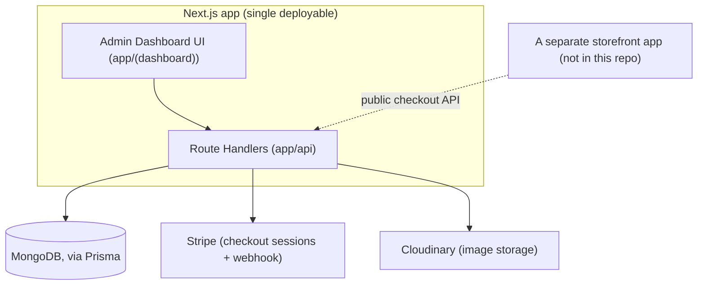

# Architecture

This is a **modular monolith**: one Next.js App Router application serves
the admin dashboard UI and its API routes. There is no separate backend
service, no message queue, and no plan to introduce either until there's a
concrete reason grounded in this app's actual load, not speculative scale.

## Layers

- **`app/(dashboard)`** — the authenticated admin UI, path-scoped by
  `[storeId]`. Server components fetch directly from Prisma.
- **`app/api`** — route handlers. Every mutating route re-derives the
  caller's identity via Clerk's `auth()` and re-checks store ownership
  against the database — never trusts a client-supplied claim of ownership.
- **`lib/prismadb.ts`** — a singleton `PrismaClient`, reused across hot
  reloads in development.
- **`actions/actions.ts`** — read-only aggregate queries for the dashboard's
  KPI cards. Not a general "actions" layer; if this grows, it should become
  proper domain services (see [Where this is headed](#where-this-is-headed)).

## Authentication and authorization

See [docs/architecture/authentication.md](docs/architecture/authentication.md)
and [docs/architecture/authorization.md](docs/architecture/authorization.md)
for detail. In short:

- **Authentication** is Clerk. `middleware.ts` marks all `/api/*` routes as
  Clerk-public, so Clerk itself performs no enforcement there — every route
  handler calls `auth()` and checks `userId` itself.
- **Authorization** today is one rule: a `Store` has exactly one owning
  `userId`, and every mutation must confirm the resource being changed
  belongs to a store the caller owns. This check must be **repeated per
  resource** (store ownership alone doesn't prove ownership of a specific
  product/category/etc. — the resource's own `storeId` must also be
  checked). This was a real vulnerability class here until
  [docs/audits/current-state.md](docs/audits/current-state.md) caught and
  fixed it; the fix is enforced going forward by the cross-store
  authorization tests in `tests/integration/`.
- There is no team/role model yet (§16 of the roadmap) — ownership is a
  single Clerk user id per store, full stop.

## Data model

Store → {Billboard, Category, Size, Product} → Image, and
Order → OrderItem → Product. See [prisma/schema.prisma](prisma/schema.prisma)
for the source of truth. Notable current constraints (see
[docs/architecture/multi-tenancy.md](docs/architecture/multi-tenancy.md) for
the database platform's implications):

- Money is a bare `Float` with no currency field — flagged for migration to
  integer minor units (Mongo's Prisma connector doesn't support `Decimal`).
- `OrderItem` has no `quantity` — see the audit for why this currently
  produces wrong order totals.
- Payment state is a single `Order.isPaid: Boolean`, not a payment/refund
  domain.

## External integrations

Stripe and Cloudinary are called directly from route handlers and form
components today — there's no provider abstraction yet. That's intentional
for now (see [ROADMAP.md](ROADMAP.md) v0.4): a `PaymentProvider` /
`StorageProvider` interface is only worth introducing once there's a second
real implementation to design against, not preemptively.

## Where this is headed

`ROADMAP.md` has the full phased plan. The short version: domain modules
(`modules/catalog`, `modules/orders`, etc.) replacing route-handler-as-domain-
logic, a proper order/payment lifecycle, organizations with role-based
permissions, and a versioned public API for headless storefront clients —
each phased so the app stays runnable and tested at every step.
