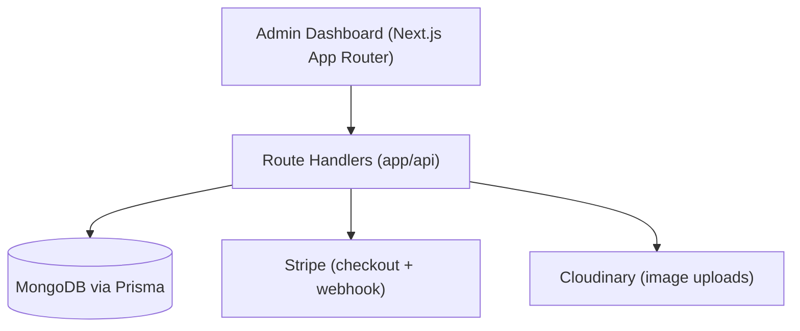

# Ecommerce Dashboard

An open-source, developer-first commerce management platform for building and
operating modern web, mobile, POS, and headless storefronts.

[](https://github.com/Kayange123/ecommerce-dashboard/actions/workflows/ci.yml)
[](LICENSE)

## Why this exists

Most open-source ecommerce admin templates are personal tutorial projects:
useful to learn from, hard to actually run a business on or contribute to.
This project starts from one of those templates and is being evolved,
piece by piece, into something a team could self-host and a contributor
could extend without asking a maintainer for help — a well-structured
modular monolith rather than a rewrite into microservices.

See [ROADMAP.md](ROADMAP.md) for where this is headed and
[docs/audits/current-state.md](docs/audits/current-state.md) for an honest,
current-as-of-audit account of what's solid and what isn't yet.

## Who it's for

- Developers who want a self-hosted admin dashboard for a small-to-medium
  storefront without paying for a SaaS platform.
- Contributors who want a real, moderately-sized Next.js + Prisma codebase
  to practice on — see [CONTRIBUTING.md](CONTRIBUTING.md) and the
  [good first issues](docs/contributing/good-first-issues.md).
- Teams evaluating whether to build on this as a headless commerce backend
  for their own storefront.

## What currently works

- Clerk-based authentication (sign in / sign up).
- Multi-store creation and switching, scoped per authenticated user.
- Per-store CRUD for billboards, categories, sizes, and products (with image
  galleries via Cloudinary, `isFeatured`/`isArchived` flags).
- A read-only order list per store.
- A public checkout API that creates a Stripe Checkout Session, paired with
  a webhook that marks orders paid.
- Dashboard KPIs: total revenue, sales count, in-stock product count.

What's _not_ here yet — proper inventory, order lifecycle beyond
paid/unpaid, a payment/refund domain, organizations & team roles, a
versioned public API, webhooks for integrators — is tracked in
[ROADMAP.md](ROADMAP.md).

## Architecture



One Next.js application serves both the admin UI and its API routes; there
is no separate backend service. See [ARCHITECTURE.md](ARCHITECTURE.md) for
the full breakdown, including the auth and authorization model.

## Quick start

Prerequisites: Node.js 20+, Docker (for local MongoDB), and free accounts
with [Clerk](https://clerk.com), [Stripe](https://stripe.com), and
[Cloudinary](https://cloudinary.com) — none of these three have a local
offline fallback today (see [ARCHITECTURE.md](ARCHITECTURE.md) for why).

```bash
git clone https://github.com/Kayange123/ecommerce-dashboard.git
cd ecommerce-dashboard

cp .env.example .env
# Fill in CLERK_*, STRIPE_*, and NEXT_PUBLIC_CLOUDINARY_CLOUD_NAME in .env

docker compose up -d   # starts a local MongoDB replica set
npm install
npm run db:migrate     # `prisma db push` — MongoDB has no migration history
npm run dev
```

Open http://localhost:3000, sign up, and create your first store. Then, to
populate it with realistic demo data:

```bash
# Copy your Clerk user id (Clerk dashboard → Users) into SEED_CLERK_USER_ID
# in .env, then:
npm run db:seed
```

## Environment configuration

Every variable is documented inline in [`.env.example`](.env.example).
Summary:

| Variable                                                 | Required           | Purpose                                           |
| -------------------------------------------------------- | ------------------ | ------------------------------------------------- |
| `DATABASE_URL`                                           | yes                | MongoDB connection string (local Docker or Atlas) |
| `NEXT_PUBLIC_CLERK_PUBLISHABLE_KEY` / `CLERK_SECRET_KEY` | yes                | Authentication                                    |
| `SEED_CLERK_USER_ID`                                     | only for `db:seed` | Attaches demo data to your account                |
| `NEXT_PUBLIC_CLOUDINARY_CLOUD_NAME`                      | yes                | Product/billboard image uploads                   |
| `STRIPE_SECRET_KEY` / `STRIPE_WEB_HOOK_SECRET`           | yes                | Checkout + payment webhook                        |
| `NEXT_PUBLIC_STORE_URL`                                  | yes                | Storefront origin for Stripe redirects            |

## Database

MongoDB via Prisma. See [docs/architecture/multi-tenancy.md](docs/architecture/multi-tenancy.md)
and the audit for the specific constraints this brings (no `prisma migrate`,
no `Decimal` type, replica set required for transactions).

```bash
npm run db:migrate   # applies the current Prisma schema (prisma db push)
npm run db:seed      # idempotent — creates demo data if it doesn't exist
npm run db:reset      # deletes and recreates demo data
```

## Testing

```bash
npm run test              # unit + integration tests (Vitest)
npm run test:watch
npm run test:integration
npm run test:e2e          # Playwright — requires `npx playwright install` once
npm run typecheck
npm run lint
npm run format:check
```

See [docs/audits/current-state.md](docs/audits/current-state.md) for current
test coverage and gaps.

## Roadmap

See [ROADMAP.md](ROADMAP.md).

## Contributing

See [CONTRIBUTING.md](CONTRIBUTING.md), [ARCHITECTURE.md](ARCHITECTURE.md),
and [AGENTS.md](AGENTS.md) (if you're an AI coding agent). We keep a running
list of [good first issues](docs/contributing/good-first-issues.md).

## Deployment

The app builds as a standard Next.js application (`npm run build && npm run
start`), or as a container via the provided [Dockerfile](Dockerfile). It
needs a reachable MongoDB replica set, and Clerk/Stripe/Cloudinary
credentials for production, not test, environments.

## Security

See [SECURITY.md](SECURITY.md) for how to report a vulnerability.

## License

[MIT](LICENSE)
